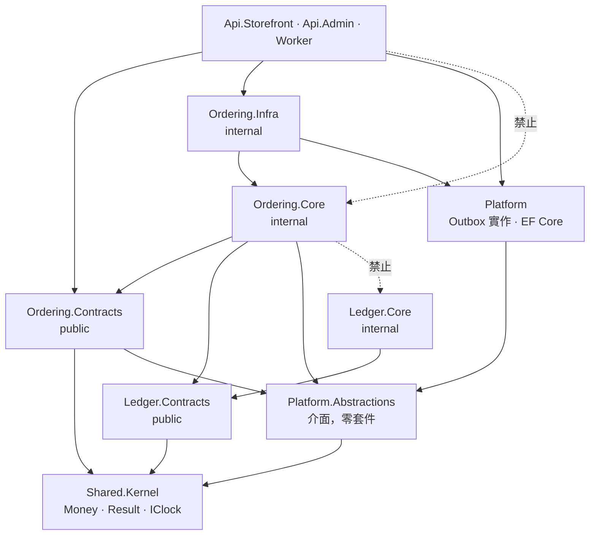

# 系統結構

十四個限界上下文、三個執行單元、十五個 Postgres schema。
完整的 23 張圖在[藍圖 v1.0](https://claude.ai/code/artifact/9a61eb42-df39-418e-9789-38b8ffa8a6f2)；
這裡只放**寫程式時真的會查**的那幾張，以及圖上沒有的落地細節。

## 1. 模組地圖

依角色分四群。每個模組一個 assembly 組（Contracts / Core / Infra）、一個 schema、一個 DB role。

| # | 模組 | schema | 職責 | 里程碑 |
|---|---|---|---|---|
| 1 | Identity | `iam` | 客戶帳號、團隊成員、角色權限、Session | M1a |
| 2 | Catalog | `catalog` | Product / SKU、分類、媒體、**重量與長寬高** | M1a |
| 3 | Campaign | `campaign` | 開團生命週期 ＋ **採購旅程**：目的地、出發／回國日、旅程成本 | M1a |
| 4 | Pricing | `pricing` | 國內運費（M1a 一口價，M3 規則引擎）、`DeliveryMethod` | M1a |
| 5 | Inventory | `inventory` | **批號別實際成本**、可用／保留、批發進貨、退貨入庫 | M2 |
| 6 | Checkout | `checkout` | 購物車、報價快照、下單前驗證 | M1a |
| 7 | Ordering | `ordering` | 訂單聚合根、狀態機、Saga 編排 | M1a |
| 8 | Procurement | `procurement` | 現場採購逐項決策、詢問客人的軌跡與逾時放行 | M1b |
| 9 | Fulfillment | `fulfillment` | **只有國內配送**：超商取貨、宅配、包裹、拆併單 | M1b |
| 10 | Payment | `payment` | 一次付清、退款、三家金流路由與分別對帳 | M1a（只綠界） |
| 11 | Ledger | `ledger` | 複式記帳、儲值金、每團真實毛利 | M1a |
| 12 | Notification | `notify` | LINE 為主。**現場詢價是關鍵路徑，不只是通知** | M1b |
| 13 | Audit | `audit` | 操作稽核、個資存取紀錄、不可竄改追溯 | M3 |
| 14 | Reporting | `reporting` | read model、每團真實毛利、對帳報表 | M3 |

**支撐群（Notification / Audit / Reporting）只有進箭頭，沒有出箭頭。**
判斷邊界切得對不對的快速檢查：如果 Ordering 需要 `import` Notification 才能發通知，邊界就已經破了。

## 2. 組件參考規則



標「禁止」的兩條是重點：

- `Ordering.Core` 可以參考 `Ledger.Contracts`（公開契約），**絕不可以**參考 `Ledger.Core`。
  Core 裡的型別全部是 `internal`，C# 編譯器本身就會擋；`Architecture.Tests` 再加一層組件層級的斷言，
  防止有人用 `InternalsVisibleTo` 開後門。
- Host 可以參考 `*.Infra`，但**只為了呼叫組合根**（`IModuleRegistration` 的 `Add*Module()`）。
  Host 不得參考任何 `*.Core`。

`tests/Daigou.Architecture.Tests` 現有 10 條斷言，斷言的對象是 **`.csproj` 裡宣告的
`ProjectReference`**，不是編譯後的組件參考，也不是型別。

這一點踩過坑，記下來：第一版用 `Assembly.GetReferencedAssemblies()` 寫，
故意讓 `Ordering.Core` 參考 `Ledger.Core` 之後測試**完全沒反應**——
因為編譯器會把「有宣告但程式碼沒用到」的參考從組件 manifest 裡裁掉，
而此時所有 Core 專案都還是空的。型別層級的規則（NetArchTest）有同樣的問題：
沒有型別就沒有東西可以違規，測試會空跑通過。

專案檔是宣告的來源，不會被裁掉，所以邊界規則必須在這一層斷。
改寫後同樣的違規會讓測試失敗（2026-08-28 實測）。

## 3. Contracts 的相依層級

Contracts 之間允許相依（否則事件裡只能傳裸 `Guid`），但**必須是 DAG**（ADR-014）：

```
L0  Identity            Catalog
L1  Notification→I      Audit→I
L2  Pricing→C,I         Campaign→C
L3  Inventory→C,Cmp
L4  Checkout→I,C,Cmp,P,Inv
L5  Ordering→I,C,Cmp,P,Inv,Chk
L6  Fulfillment→I,P,Ord   Payment→I,Ord   Procurement→C,Cmp,Inv,Ord
    Ledger→I,Cmp          Reporting→Cmp,Ord,Led
```

`Core` 的相依是這張圖的**超集**——因為 Core 還要訂閱下游模組的事件。
例如 `Ordering.Core → Fulfillment.Contracts`（訂閱 `ShipmentDispatched`），
而 `Fulfillment.Contracts → Ordering.Contracts`。這不是環：Contracts 從不參考 Core。

## 4. 執行單元與 port

代購平台的三個新行程，與 YC 上既有 12 個服務共存。**用 5000 號段**避開現有占用。

| 行程 | port | 說明 |
|---|---|---|
| `Daigou.Api.Storefront` | 5000 | 公開 BFF，前面是 Cloudflare WAF ＋ Turnstile ＋ Rate Limit |
| `Daigou.Api.Admin` | 5001 | 內部 BFF，前面是 Cloudflare Access（Zero Trust） |
| `Daigou.Worker` | — | 無 listener。Outbox dispatcher、Saga timer、排程、報表 |
| PostgreSQL 17 | 5432 | data 與 `pg_wal` **必須在 C 槽 NVMe** |
| Valkey | 6379 | session、rate limit、鎖。**業務事件絕不走這裡**，會掉訊息 |

既有占用（不要碰）：3000 · 3300 · 3400 · 3456 · 3500 · 3600/3601 · 3700 · 3800 · 8000 ·
11434 · 19530/19531 · 27017 · 4040–4045（ngrok，M-1 換成 cloudflared 單行程）。

新服務要登記進 prod-monitor 的 process／port 指紋，這是 M-1 的驗收條件之一。

## 5. 磁碟配置（不可協商）

| 資料 | 位置 | 理由 |
|---|---|---|
| Postgres data directory | **C 槽 NVMe** | 隨機讀寫密集 |
| Postgres WAL（`pg_wal`） | **C 槽 NVMe** | 同步小量隨機寫，直接決定每筆交易的 commit 延遲 |
| 應用程式二進位與設定 | C 槽 | 啟動速度 |
| WAL 歸檔、每日 dump | D 槽 → 再上 R2 | 大量循序寫，機械碟很擅長 |
| 應用日誌、OTel 冷資料 | D 槽 | 循序追加 |
| 商品圖原檔暫存 | D 槽 → 再上 R2 | 循序寫，體積大 |

D 槽有 866 GB 空閒而 C 槽只剩 316 GB，這個數字會誘使任何人把資料庫放 D 槽。**不要。**
D 槽是 Seagate ST1000LM049，2.5" SATA 機械碟且屬 SMR 疊瓦式——WAL 放上去會讓結帳延遲
從毫秒級變成數百毫秒級，高峰時是雪崩式的。訂單資料本身很小（圖片都在 R2），
316 GB 對代購的資料量綽綽有餘。

## 6. 十三個服務共存的運維問題

每一條都要在 M-1 處理掉，否則它們會在你最忙的時候一起出現。

| 問題 | 症狀 | 處置 |
|---|---|---|
| I/O 互搶 | WAL 寫入、checkpoint、每日備份與 Defender 即時掃描同時搶 C 槽 | **Defender 排除 pg data 與 pg_wal 目錄**（這條最有感）；備份排離峰 |
| 磁碟寫滿 | log 累積或 WAL 未歸檔 → Postgres 停止寫入，整站當掉 | log 輪替加保留上限；WAL 歸檔到 D 槽後刪除；prod-monitor 加磁碟水位告警 |
| 記憶體與 CPU 爭用 | Ollama 推論或 `dotnet build` 時 Postgres 換頁、GC 延遲拉長 | `shared_buffers` 壓在 2 GB；**不要在正式機上做建置** |
| 熱降頻 | 筆電散熱受限，長時間高負載延遲毫無預警變差 | 監控 CPU 溫度與頻率；正式機不兼做建置或跑模型 |
| 服務啟動順序 | Postgres 還沒起來應用先起來，卡在失敗狀態 | 應用啟動時重試連線並退避，**不要依賴啟動順序** |
| Port 衝突 | 既有 13 個 port 已占用 | 用 5000 號段並登記進 prod-monitor |
| 殭屍程序 | 舊版沒死乾淨，新舊兩份搶同一個 outbox | 部署腳本先確認舊 process 已終止；outbox dispatcher 用 advisory lock 互斥 |

**兩個容易誤解的地方**：

1. **Cloudflare Tunnel 不提供可用性。** 它保護的是「連線」，讓你不用開 inbound port。
   主機掛掉、Postgres 停了、Windows 半夜重開，Tunnel 一點忙也幫不上。
   可用性靠 UPS ＋ 服務自動重啟 ＋ 告警。
2. **同一台機器上的備份不算備份。** D 槽只是中繼站。C 槽掛了、機器被偷了、勒索軟體加密了整台，
   D 槽的備份一起沒。備份必須離開這台機器（上 R2），而且**每季實際演練還原一次**。
