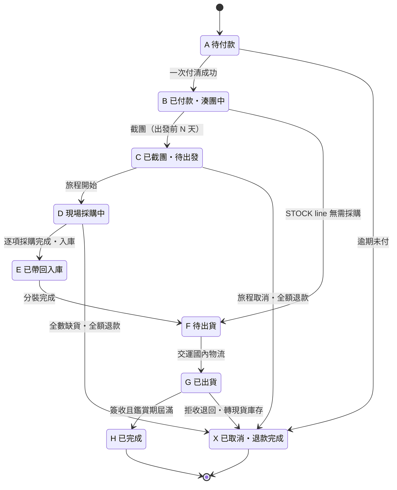
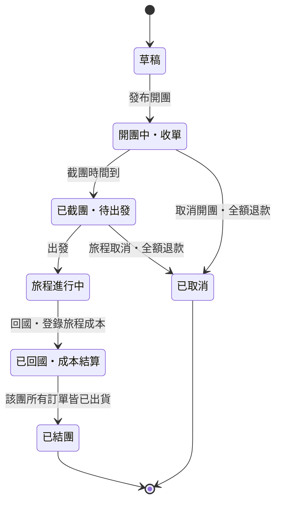

# 事件目錄、狀態機與補償

## 1. 事件目錄

事件只承載「已發生的事實 ＋ 識別碼」，不承載對方模組的內部模型。需要細節就回頭呼叫 Contracts。
型別名一經上線不可改名——改名等於破壞契約，要改就發 `.v2` 並讓兩版並存一段時間。

| 事件型別名 | 發布者 | 訂閱者 | 里程碑 |
|---|---|---|---|
| `iam.CustomerRegistered.v1` | Identity | Notification, Audit | M1a |
| `iam.CustomerDeactivated.v1` | Identity | Audit | M1a |
| `catalog.SkuPublished.v1` | Catalog | Channel(M4), Audit | M1a |
| `catalog.SkuArchived.v1` | Catalog | Channel(M4) | M1a |
| `catalog.SkuAttributesChanged.v1` | Catalog | Pricing, Channel(M4) | M1a |
| `pricing.FeeRuleSetPublished.v1` | Pricing | Audit | M3 |
| `campaign.CampaignPublished.v1` | Campaign | Notification | M1a |
| `campaign.CampaignClosed.v1` | Campaign | **Procurement**, Notification | M1b |
| `campaign.TripCostRecorded.v1` | Campaign | **Ledger**, Reporting | M1b |
| `campaign.CampaignCancelled.v1` | Campaign | Ordering, Notification | M1b |
| `campaign.CampaignSettled.v1` | Campaign | Reporting | M1b |
| `inventory.LotCreated.v1` | Inventory | Reporting | M2 |
| `inventory.StockReserved.v1` | Inventory | Ordering | M2 |
| `inventory.StockReleased.v1` | Inventory | Ordering | M2 |
| `inventory.StockCostAllocated.v1` | Inventory | **Ledger**, Reporting | M1b |
| `checkout.CheckoutCompleted.v1` | Checkout | **Ordering** | M1a |
| `ordering.OrderPlaced.v1` | Ordering | Campaign, Inventory, Audit, Reporting | M1a |
| `ordering.PaymentRequested.v1` | Ordering | **Payment** | M1a |
| `ordering.OrderPaid.v1` | Ordering | Notification, Reporting | M1a |
| `ordering.OrderReadyToShip.v1` | Ordering | **Fulfillment** | M1b |
| `ordering.OrderCompleted.v1` | Ordering | **Ledger**, Reporting | M1a |
| `ordering.OrderCancelled.v1` | Ordering | Payment, Inventory, Notification, Audit | M1a |
| `ordering.OrderLineCancelled.v1` | Ordering | Payment, Notification | M1a |
| `ordering.RefundRequested.v1` | Ordering | **Payment** | M1a |
| `procurement.ItemPurchased.v1` | Procurement | Ordering, Inventory | M1b |
| `procurement.GoodsReceived.v1` | Procurement | **Inventory**, **Ledger** | M1b |
| `procurement.ItemUnavailable.v1` | Procurement | **Ordering** | M1b |
| `procurement.ItemPriceChanged.v1` | Procurement | **Notification** | M1b |
| `procurement.InquiryResolved.v1` | Procurement | Audit | M1b |
| `fulfillment.ShipmentDispatched.v1` | Fulfillment | Ordering, **Ledger**, Notification | M1b |
| `fulfillment.ShipmentDelivered.v1` | Fulfillment | Ordering, Notification | M1b |
| `fulfillment.ReturnReceived.v1` | Fulfillment | **Inventory**, Ordering | M1b |
| `fulfillment.ShipmentLost.v1` | Fulfillment | Ordering, Notification | M1b |
| `payment.PaymentCaptured.v1` | Payment | **Ledger**, **Ordering** | M1a |
| `payment.PaymentFailed.v1` | Payment | Ordering, Notification | M1a |
| `payment.PaymentInstructionsIssued.v1` | Payment | Ordering | M1a（ADR-044：ATM／超商代碼／條碼已取號；Ordering 據此把 `PaymentDueAt` 改成綠界期限，BE-64 接） |
| `payment.PaymentRefunded.v1` | Payment | **Ledger**, Ordering | M1a |
| `payment.PayoutSettled.v1` | Payment | **Ledger** | M1a |
| `payment.ReconciliationDiscrepancyFound.v1` | Payment | Notification, Audit | M3 |
| `ledger.JournalPosted.v1` | Ledger | Reporting | M1a |
| `ledger.LiabilityExceededCash.v1` | Ledger | Notification | M1a |
| `notify.NotificationSent.v1` | Notification | Audit | M1b |
| `notify.NotificationFailed.v1` | Notification | Audit | M1b |
| `audit.AuditRecorded.v1` | Audit | — | M3 |
| `reporting.ReportGenerated.v1` | Reporting | Notification | M3 |

粗體是**業務關鍵路徑**——這些訂閱關係壞掉會直接讓錢或貨對不起來。

**兩條值得記住**：
`Payment → Ledger` 是單向的（Payment 不記帳，只回報結果，ADR-008）；
`Campaign → Ledger` 承載旅程成本，是「每團真實毛利」算得出來的原因。

**第七波（2026-08-30，BE-19）**：`procurement.GoodsReceived.v1` 加了 `OrderLineId`
（wire shape 異動，不是新版號——這個事件第六波才新增、從沒上過正式機，改 v1 沒有相容性成本）。
一個採購品項發一則，值取自 `PurchaseItem.OrderLineId`。
加這個欄位是為了接上「帶回入庫後訂單自動轉待出貨」這條斷線——
`IOrderingGoodsReceipt.RecordGoodsReceivedAsync` 已存在、已實作、已 DI 註冊，
但接線（訂閱＋呼叫）是獨立一包 **BE-21**，等這一波與 BE-18 都通過才開，
所以上表的訂閱者欄位還沒加 Ordering。

**第四十五波（2026-10-01，ADR-044）**：`ordering.OrderCancelled.v1` 加選填 `Source`（`Customer`／`Staff`／`PaymentExpired`；init 屬性、舊事件為 `null`，比照 `checkout.CheckoutCompleted.v1` 的 `ConvenienceStoreCode`），不升版、事件數不變。上表 `OrderCancelled` 的訂閱者欄目前與程式不一致——程式只有 Inventory 訂閱（Payment、Notification、Audit 都還沒實作），本波不處理。

## 2. 訂單狀態機

九個狀態，兩種模式共用。`B → F` 那條捷徑就是現貨——`STOCK` 的 line 直接跳過採購。

**沒有 `AwaitingCustomerResponse` 這個狀態。** 現場漲價時「逾時視為照買」——
問客人是非阻塞的通知，不會卡住整團。這是刻意的設計選擇，不是遺漏。

## 3. 開團狀態機

一趟旅程對應一個團（1:1），所以旅程成本直接掛在 Campaign 上，**不需要任何攤分規則**。

**「已取消」時旅程成本仍要入帳。** 機票已經買了、旅程臨時取消，那筆錢是真實損失，
不能因為團沒成就假裝沒發生。狀態機走到 `X` 時，已登錄的 `TripCost` 保留在 Ledger 裡。

## 4. 補償路徑

每一條失敗路徑都要有明確的補償動作，而且補償本身也要記帳。
**這張表建議直接變成整合測試的 case 清單。**

| 失敗情境 | 觸發 | 補償動作 |
|---|---|---|
| 逾期未付款 | Saga Timer：信用卡建單＋24 小時；ATM／超商代碼／條碼＝綠界期限＋2 天（ADR-044） | 自動取消訂單（`Source=PaymentExpired`）、釋放庫存；客人在訂單頁看到固定說明（完整站內通知另排，系統目前沒有發送管道） |
| 取消後才入帳 | `PaymentCaptured` 到達已取消的訂單 | 記已收款、維持已取消、發 `RefundRequested`（原路）；信用卡退刷，非信用卡轉待人工退款（BE-65）。**不丟例外**（否則 outbox 無限重送） |
| 現場某項缺貨 | `ItemUnavailable` | 該 OrderLine 取消並退款（客人自選原路或儲值金），**其餘 line 續行，訂單不整張作廢** |
| 現場漲價 | `ItemPriceChanged` | 發 LINE 通知並記錄軌跡 → **逾時視為照買**，差額由你吸收（團價已定死）。系統不阻塞現場動作 |
| 全數缺貨 | 所有 line 皆 unavailable | 整張訂單取消、全額退款、Ledger 反向分錄 |
| 旅程取消 | 人工觸發 `CampaignCancelled` | 該團全部訂單取消退款；**已發生的旅程成本仍要入帳** |
| 退款走儲值金 | `RefundRequested(to=StoredValue)` | DR 預收貨款 / CR 客戶儲值金。**完全不動金流，零手續費** |
| 包裹遺失 | 物流回報 | 開理賠案 → 賠付分錄 → 下趟補買或退款 |
| 拒收退回 | 物流回報 | **開新批號**入庫轉現貨 → 扣除已發生運費 → 部分退款 |

### 單一品項取消的狀態語意（M1a-6）

`POST /v1/orders/{orderId}/lines/{lineId}/cancel` 的 frozen description 明確限定為
「現場缺貨時用」，因此這條補償會把該 line 轉成 `Unavailable`，並保存完整
`refundedAmount = lineTotal`；其他 line 與訂單狀態不變，訂單金額只扣掉該 line。

`Cancelled` 保留給整張訂單取消時的 line，或未來另行定義的非缺貨單品取消。
這兩個狀態不是同義詞；不可用 `reason` 字串猜是哪一種。

## 5. 帳務分錄對照

兩種模式用**同一組科目**。唯一的差別是存貨怎麼進來。

| 階段 | 業務事件 | 借方 DR | 貸方 CR |
|---|---|---|---|
| — | 批發進貨 100 件 @ 80（現貨） | 存貨 8,000 | 現金 8,000 |
| ③ | 客人付清 3,000（`PaymentCaptured`） | 綠界在途 3,000 | 預收貨款 2,800 · 預收運費 200 |
| ⑤ | 現場刷卡買入（`GoodsReceived`） | 存貨 2,520 | 現金 2,520 |
| ⑤ | 某項缺貨退款（客人選儲值金） | 預收貨款 X | 客戶儲值金 X |
| ⑥ | 旅程成本（`TripCostRecorded`） | 旅程成本 10,000 | 現金 10,000 |
| ⑦ | 出貨從批號結轉（`StockCostAllocated`） | 銷貨成本 2,520 | 存貨 2,520 |
| ⑦ | 支付宅配運費（`ShipmentDispatched`） | 運費成本 150 | 現金 150 |
| ⑧ | 完成，預收轉收入（`OrderCompleted`） | 預收貨款 2,800 · 預收運費 200 | 銷貨收入 2,800 · 運費收入 200 |
| — | 綠界撥款到帳（`PayoutSettled`） | 現金 2,970 · 手續費 30 | 綠界在途 3,000 |

**三條不可協商的不變式**（下沉到資料庫，不能只靠應用層）：

1. 每筆 entry 內，同幣別的 DR 合計 = CR 合計 → CHECK constraint 或 deferred trigger
2. entry 一經 posted 即**不可修改** → 更正只能開反向分錄（紅字沖銷）
3. 金額一律 `long` 最小單位 ＋ Currency → 禁用 float / double / decimal 當金額欄位

**每日告警**：`預收貨款 + 預收運費 + 客戶儲值金 > 現金餘額`
→ 你正在用還沒交貨的錢過日子。這是代購生意最典型的崩壞前兆。

**每團真實毛利** = 銷貨收入 − 銷貨成本 + 運費收入 − 運費成本 − 旅程成本
